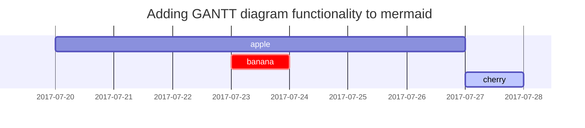

This post is to show Markdown syntax rendering on [**Chirpy**](https://github.com/cotes2020/jekyll-theme-chirpy/){:target="_blank"}, you can also use it as an example of writing and a MarkDown cheat sheet.

This cheat sheet covers some commonly used Markdown syntax, but there are many more features and extensions available. For detailed information, refer to the [official Markdown documentation](https://daringfireball.net/projects/markdown/){:target="_blank"}.

Now, let's start looking at text and typography.

***Table of contents***:

- [Headings](#headings)
  - [Heading 1](#heading-1)
  - [Heading 2](#heading-2)
  - [Heading 3](#heading-3)
  - [Heading 4](#heading-4)
  - [Heading 5](#heading-5)
  - [Heading 6](#heading-6)
  - [Headers with IDs](#headers-with-ids)
- [Emphasis](#emphasis)
  - [Highlight text](#highlight-text)
- [Horizontal Rule](#horizontal-rule)
- [Line Breaks](#line-breaks)
- [Escaping Characters](#escaping-characters)
- [Lists](#lists)
  - [Ordered list](#ordered-list)
  - [Unordered list](#unordered-list)
  - [ToDo list](#todo-list)
  - [Description list](#description-list)
- [Collapsible](#collapsible)
- [Block Quote](#block-quote)
- [Prompts](#prompts)
- [Tables](#tables)
- [Links](#links)
  - [Inline hyperlink](#inline-hyperlink)
  - [Inline hyperlink Text](#inline-hyperlink-text)
    - [Inline hyperlink with new tab attribute](#inline-hyperlink-with-new-tab-attribute)
- [Inline code](#inline-code)
- [Filepath](#filepath)
- [Code blocks](#code-blocks)
  - [Common](#common)
  - [Specific Language](#specific-language)
  - [Specific filename](#specific-filename)
- [Mathematics](#mathematics)
- [Mermaid SVG](#mermaid-svg)
- [Images](#images)
  - [Default (with caption)](#default-with-caption)
  - [Left aligned](#left-aligned)
  - [Float to left](#float-to-left)
  - [Float to right](#float-to-right)
  - [Dark/Light mode \& Shadow](#darklight-mode--shadow)
- [Video](#video)
- [Footnote](#footnote)
- [Reverse Footnote](#reverse-footnote)

## Headings

<h1 class="mt-5">H1 - heading</h1>

<h2 data-toc-skip>H2 - heading</h2>

<h3 data-toc-skip>H3 - heading</h3>

<h4>H4 - heading</h4>

```md
<h1 class="mt-5">H1 - heading</h1>

<h2 data-toc-skip>H2 - heading</h2>

<h3 data-toc-skip>H3 - heading</h3>

<h4>H4 - heading</h4>
```

### Heading 1

```md
# Heading 1
```

### Heading 2

```md
## Heading 2
```

### Heading 3

```md
### Heading 3
```

### Heading 4

```md
#### Heading 4
```

### Heading 5

```md
##### Heading 5
```

### Heading 6

```md
###### Heading 6
```

### Headers with IDs

```md
## Heading {#custom-id}
```

## Emphasis

- *Italic Text*
- **Bold Text**
- ~~Strikethrough Text~~
- <u>Underline</u>

```md
*Italic Text*
**Bold Text**
~~Strikethrough Text~~
<u>Underline</u>
```

### Highlight text

Inline HTML: Since Markdown supports inline HTML, you can directly use HTML code for highlighting within your Markdown document.

```markdown
This is some <span style="background-color: #FFFF99;">highlighted text</span> in Markdown.
```

- This is some <span style="background-color: #FFFF99;">highlighted text</span> in Markdown.

## Horizontal Rule

Some text

---
Some other text

```md
---
```

## Line Breaks

Text 1<br>
Text 2

```md
Text 1<br>
Text 2
```

## Escaping Characters

\* Escaped Asterisk \*

```md
\* Escaped Asterisk \*
```

## Lists

### Ordered list

1. Firstly
2. Secondly
3. Thirdly

```md
1. Firstly
2. Secondly
3. Thirdly
```

### Unordered list

- Chapter
  - Section
    - Paragraph

```md
- Chapter
  + Section
    * Paragraph
```

### ToDo list

- [ ] Job
  - [x] Step 1
  - [x] Step 2
  - [ ] Step 3

```md
- [ ] Job
  + [x] Step 1
  + [x] Step 2
  + [ ] Step 3
```

### Description list

Sun
: the star around which the earth orbits

Moon
: the natural satellite of the earth, visible by reflected light from the sun

```md
Sun
: the star around which the earth orbits

Moon
: the natural satellite of the earth, visible by reflected light from the sun
```

## Collapsible

You can use `HTML` and `CSS` to create a collapsible section in Markdown. The most common way is to use a combination of HTML and CSS with a checkbox and the adjacent sibling selector (`+`).

1. Write your Markdown content as usual, including the content you want to make collapsible.

2. Convert the collapsible section into an HTML block using `<details>` and `<summary>` tags. The `<summary>` tag will serve as the collapsible header.

3. Style the collapsible section with CSS to control its appearance and behavior.

Here's an example of how to create a collapsible section in Markdown:

```markdown
<details>
  <summary>Click to expand/collapse</summary>

  This is the content of the collapsible section.

  - You can include lists
  - Add various elements
  - Any content you want!

</details>
```

When rendered, the content inside the `<details>` element will be hidden initially, and users will see the summary as the header of the collapsible section. Clicking on the summary will toggle the visibility of the content.

> The exact appearance and behavior of collapsible sections may vary slightly depending on the Markdown rendering engine.
{: .prompt-warning }

## Block Quote

> This line shows the *block quote*.

```md
> This line shows the _block quote_.
```

## Prompts

> An example showing the `tip` type prompt.
{: .prompt-tip }

```md
{: .prompt-tip }
```

> An example showing the `info` type prompt.
{: .prompt-info }

```md
{: .prompt-info }
```

> An example showing the `warning` type prompt.
{: .prompt-warning }

```md
{: .prompt-warning }
```

> An example showing the `danger` type prompt.
{: .prompt-danger }

```md
{: .prompt-danger }
```

## Tables

| Company                      | Contact          | Country |
|:-----------------------------|:-----------------|--------:|
| Alfreds Futterkiste          | Maria Anders     | Germany |
| Island Trading               | Helen Bennett    | UK      |
| Magazzini Alimentari Riuniti | Giovanni Rovelli | Italy   |

```md
| Company                      | Contact          | Country |
|:-----------------------------|:-----------------|--------:|
| Alfreds Futterkiste          | Maria Anders     | Germany |
| Island Trading               | Helen Bennett    | UK      |
| Magazzini Alimentari Riuniti | Giovanni Rovelli | Italy   |
```

## Links

### Inline hyperlink

<http://127.0.0.1:4000>

```md
<http://127.0.0.1:4000>
```

### Inline hyperlink Text

[Link Text](https://www.example.com)

```md
[Link Text](https://www.example.com)
```

#### Inline hyperlink with new tab attribute

[Link Text open in a new tab](https://www.example.com){:target="_blank"}

```md
[Link Text](https://www.example.com){:target="_blank"}
```

## Inline code

This is an example of `Inline Code`.

```md
This is an example of `Inline Code`.
```

## Filepath

Here is the `/path/to/the/file.extend`{: .filepath}

```md
Here is the `/path/to/the/file.extend`{: .filepath}
```

## Code blocks

### Common

``` plaintext
This is a common code snippet, without syntax highlight and line number.
```

\`\`\` plaintext<br>
This is a common code snippet, without syntax highlight and line number.<br>
\`\`\`

### Specific Language

```bash
if [ $? -ne 0 ]; then
  echo "The command was not successful.";
  #do the needful / exit
fi;
```

> \`\`\`bash<br>
if [ $? -ne 0 ]; then<br>
  echo "The command was not successful.";<br>
  #do the needful / exit<br>
fi;<br>
\`\`\`<br>
{: .prompt-tip }

### Specific filename

```sass
@import
  "colors/light-typography",
  "colors/dark-typography";
```

{: file='_sass/jekyll-theme-chirpy.scss'}

> \`\`\`sass<br>
@import<br>
  "colors/light-typography",<br>
  "colors/dark-typography";<br>
\`\`\`<br>
{: file='_sass/jekyll-theme-chirpy.scss'}
{: .prompt-tip }

## Mathematics

The mathematics powered by [**MathJax**](https://mathjax.org){:target="_blank"}:

$$ \sum_{n=1}^\infty 1/n^2 = \frac{\pi^2}{6} $$

When $a \ne 0$, there are two solutions to $ax^2 + bx + c = 0$ and they are

$$ x = {-b \pm \sqrt{b^2-4ac} \over 2a} $$

```md
The mathematics powered by [**MathJax**](https://mathjax.org){:target="_blank"}:

$$ \sum_{n=1}^\infty 1/n^2 = \frac{\pi^2}{6} $$

When $a \ne 0$, there are two solutions to $ax^2 + bx + c = 0$ and they are

$$ x = {-b \pm \sqrt{b^2-4ac} \over 2a} $$
```

## Mermaid SVG



>\`\`\`mermaid<br>
 gantt<br>
  title  Adding GANTT diagram functionality to mermaid<br>
  apple :a, 2017-07-20, 1w<br>
  banana :crit, b, 2017-07-23, 1d<br>
  cherry :active, c, after b a, 1d<br>
\`\`\`<br>
{: .prompt-tip }

## Images

### Default (with caption)

{: width="972" height="589" }
*Full screen width and center alignment*

```md
{: width="972" height="589" }
_Full screen width and center alignment_
```

### Left aligned

{: width="972" height="589" .w-75 .normal}

```md
{: width="972" height="589" .w-75 .normal}
```

### Float to left

{: width="972" height="589" .w-50 .left}
Praesent maximus aliquam sapien. Sed vel neque in dolor pulvinar auctor. Maecenas pharetra, sem sit amet interdum posuere, tellus lacus eleifend magna, ac lobortis felis ipsum id sapien. Proin ornare rutrum metus, ac convallis diam volutpat sit amet. Phasellus volutpat, elit sit amet tincidunt mollis, felis mi scelerisque mauris, ut facilisis leo magna accumsan sapien. In rutrum vehicula nisl eget tempor. Nullam maximus ullamcorper libero non maximus. Integer ultricies velit id convallis varius. Praesent eu nisl eu urna finibus ultrices id nec ex. Mauris ac mattis quam. Fusce aliquam est nec sapien bibendum, vitae malesuada ligula condimentum.

```md
{: width="972" height="589" .w-50 .left}
```

### Float to right

{: width="972" height="589" .w-50 .right}
Praesent maximus aliquam sapien. Sed vel neque in dolor pulvinar auctor. Maecenas pharetra, sem sit amet interdum posuere, tellus lacus eleifend magna, ac lobortis felis ipsum id sapien. Proin ornare rutrum metus, ac convallis diam volutpat sit amet. Phasellus volutpat, elit sit amet tincidunt mollis, felis mi scelerisque mauris, ut facilisis leo magna accumsan sapien. In rutrum vehicula nisl eget tempor. Nullam maximus ullamcorper libero non maximus. Integer ultricies velit id convallis varius. Praesent eu nisl eu urna finibus ultrices id nec ex. Mauris ac mattis quam. Fusce aliquam est nec sapien bibendum, vitae malesuada ligula condimentum.

```md
{: width="972" height="589" .w-50 .right}
```

### Dark/Light mode & Shadow

The image below will toggle dark/light mode based on theme preference, notice it has shadows.

{: .light .w-75 .shadow .rounded-10 w='1212' h='668' }

{: .dark .w-75 .shadow .rounded-10 w='1212' h='668' }

```md
{: .light .w-75 .shadow .rounded-10 w='1212' h='668' }
{: .dark .w-75 .shadow .rounded-10 w='1212' h='668' }
```

## Video



```md

```

## Footnote

Click the hook will locate the footnote[^footnote], and here is another footnote[^fn-nth-2].

```md
Click the hook will locate the footnote[^footnote], and here is another footnote[^fn-nth-2].
```

## Reverse Footnote

[^footnote]: The footnote source
[^fn-nth-2]: The 2nd footnote source

```md
[^footnote]: The footnote source
[^fn-nth-2]: The 2nd footnote source
```
