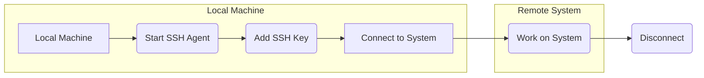

This document outlines my approach to accessing remote systems, emphasizing the use of SSH for secure connections. It focuses on using SSH agent forwarding to avoid the hassle and security risks of storing my private SSH key on every system I use.

I am aware of the security risks associated with SSH agent forwarding. However, as a seasoned Linux professional, I am confident in my ability to implement and adhere to best practices to effectively mitigate those risks.



## Prerequisites

- Set up the local machine:
    * I use different systems (macOS, Linux, WSL, iOS or Android).
    * An SSH client is installed and configured.
    * I use ssh authentication for my Github repositories.
    * I have SSH key pairs generated (e.g., `id_rsa` or `id_ed25519` and `id_rsa.pub` or `id_ed25519.pub` in `~/.ssh/`) for most if not all my hosts.
    * An SSH agent is installed and running.

- Setup remote systems:
    * I typically work with Unix-like operating systems (e.g., Linux, macOS, FreeBSD).
    * The remote systems have an SSH server enabled (usually the default).
    * I have a user account set up with appropriate permissions on these systems.
 

## Workflow Steps

### 2.1  Start SSH Agent (Local Machine)

* I start the SSH agent on my local machine by run the below command to start the ssh agent:

```bash
eval "$(ssh-agent -s)"
```

### 2.2  Add SSH Key to Agent (Local Machine)

Then I add my private SSH key to the agent:

```bash
ssh-add ~/.ssh/id_rsa
```

If I'm using a different key as I often use a non-standard name or location, I adjust the path. I also tend to use an alias in my `~/.bashrc` or `~/.zshrc` file to avoid too much typing.

### 2.3  Connect to Target System (Local Machine)

Still on the local machine, I connect with SSH with agent forwarding enabled:

```bash
ssh -A user@targetSystemAddress
```

### 2.4  Work on the Remote System (Remote System)

Once connected, I perform the necessary tasks. This often involves:

- Editing using VSCode via the `Remote - SSH` plugin.
- Compiling and running C++ or C code (as seen in my projects).   
- Executing Python scripts (which I use for automation).   
- Managing system services (like I did at MousePaw Media).   
- Working with Git.
- Using debugging tools (like LLDB, which I'm familiar with).   
- My SSH agent is forwarded, so if I need to access other systems from this one, I can do so without additional key setup.

## Configuration Notes

### 3.1  SSH Configuration File (~/.ssh/config)

On my local `~/.ssh/config` file I store connection settings, which simplifies the process.

- Example:

```bash
Host myServer1
HostName server1.example.com
Port 2222
User myUser
ForwardAgent yes
```

> The `ForwardAgent yes` line is crucial.
{: .prompt-tip}


## Troubleshooting

### Permission Denied Errors

I always make sure to refer to this guide 😂, especially when I’m setting up new SSH connections. I ensure that my local public key (id_rsa.pub or id_ed25519.pub), is properly authorized on the remote system, usually found in the `~/.ssh/authorized_keys` file.

Before attempting a connection, I double-check that the **SSH agent is running and has the correct key added**. I also pay close attention to using the `-A` option correctly, as it can sometimes be tricky.

If I encounter a “Connection Refused” error, I first check my network connectivity to rule out any issues there. Then, I verify that the SSH service is running on the remote system and ensure I’m using the correct port, and firewall rules.

When it comes to security, I take my private key seriously. I protect it with the right permissions, like setting `chmod 400 ~/.ssh/id_rsa`, to keep it secure. I also make sure to use strong passphrases for my SSH keys to add an extra layer of protection.

Regularly updating my local machine and remote systems with the latest security patches is a habit I maintain to stay ahead of potential threats. Lastly, I enhance security by disabling password authentication on my remote systems, opting instead to rely solely on SSH keys for access.

## Conclusion

This document describes my SSH-based remote system access workflow, a vital skill for back-end development. By leveraging SSH agent forwarding, I ensure secure and efficient connection management. I adapt this workflow to suit various projects and environments.

## Reference

-   [SSH Agent Explained - Smallstep](https://smallstep.com/blog/ssh-agent-explained/){:target="_blank"}
-   [Understanding OpenSSH's Agent Forwarding CVE-2023-38408: A Comprehensive Guide](https://phoenix.security/openssh-agent-38408/){:target="_blank"}
-   [SSH Agent Forwarding considered harmful - Johannes 'heipei' Gilger](https://heipei.github.io/2015/02/26/SSH-Agent-Forwarding-considered-harmful/){:target="_blank"}
-   [Using SSH agent forwarding - GitHub Docs](https://docs.github.com/en/authentication/connecting-to-github-with-ssh/using-ssh-agent-forwarding){:target="_blank"}