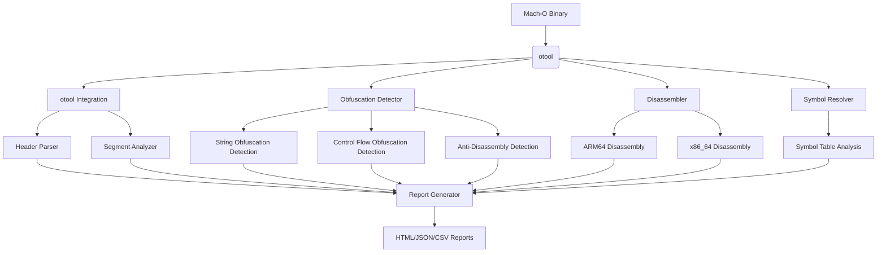

Analyze Mach-O binaries using otool as core engine, with a specific focus on `macOS` malware analysis and obfuscation detection.

[](https://github.com/wilfrantz/MachXplorer){:target="_blank"}
[](https://opensource.org/licenses/MIT){:target="_blank"}

---

table of content

- [Architecture Overview](#architecture-overview)
- [🗺 Roadmap](#-roadmap)
  - [🚧 In Progress](#-in-progress)
  - [⏳ Upcoming](#-upcoming)
  - [🔮 Future Vision](#-future-vision)
- [🛠 Features](#-features)
- [📦 Installation](#-installation)
  - [Prerequisites](#prerequisites)
- [🚀 Usage](#-usage)
- [🔍 Resource Guide](#-resource-guide)
  - [Key macOS Headers](#key-macos-headers)
- [🤝 Contributing](#-contributing)
- [Source Code](#source-code)

---

## Architecture Overview



---

## 🗺 Roadmap

- [x] Mach-O header analysis (`-h, --header`)  
- [x] Segment/section inspection (`-s, --segment`)  
- [x] Basic symbol analysis (`-y, --symbol`)  
- [x] Hex dump & string extraction (`-x, --hex`)  
- [x] Binary comparison (`-c, --compare`)  
- [x] CMake build system  

### 🚧 In Progress

- [ ] ARM64 disassembly module (`-d, --disassembly`)  
- [ ] `otool` integration pipeline  
- [ ] Obfuscation detection framework (`-o, --obfuscation`)  
- [ ] HTML report generation  

### ⏳ Upcoming  

- [ ] Universal binary (fat Mach-O) support  
- [ ] Entitlements analysis module  
- [ ] JSON/CSV export options  
- [ ] IDA Pro integration plugin  

### 🔮 Future Vision

- [ ] Dyld shared cache analysis  
- [ ] Automated anti-debugging detection  
- [ ] Machine learning anomaly scoring  
- [ ] Cross-platform (Windows/Linux) support  

- [ ] Universal binary support
- [ ] Automated suspicious pattern detection
- [ ] IDA Pro integration plugin
- [ ] Entitlements analysis module

---

## 🛠 Features

| Option                | Flag                | Description                                             |
| --------------------- | ------------------- | ------------------------------------------------------- |
| Header Analysis       | `-h, --header`      | Inspect Mach-O headers, load commands, and entry points |
| Segment Analysis      | `-s, --segment`     | Analyze memory layout, permissions, and unusual flags   |
| Symbol Analysis       | `-y, --symbol`      | Detect hidden functions and stripped symbols            |
| Disassembly           | `-d, --disassembly` | Examine executable sections with ARM64 disassembly      |
| Obfuscation Detection | `-o, --obfuscation` | Identify common obfuscation patterns                    |
| Hex & Strings         | `-x, --hex`         | Generate formatted hex dumps with string extraction     |
| Binary Comparison     | `-c, --compare`     | Diff two Mach-O binaries for integrity checks           |

## 📦 Installation

### Prerequisites

- macOS (ARM64 compatible)
- Xcode Command Line Tools
- `otool` and `llvm-objdump` (install via [Homebrew](https://brew.sh/)):

## 🚀 Usage

```sh
# Basic header inspection
./MachXplorer -h suspiciousBinary.macho

# Full analysis workflow
./MachXplorer -hsydo complexBinary.macho

# Compare two versions
./MachXplorer -c original.macho modified.macho
```

## 🔍 Resource Guide

### Key macOS Headers

- `/Library/Developer/CommandLineTools/SDKs/MacOSX.sdk/usr/include/mach-o/`

  | Header File | Purpose                        |
  | ----------- | ------------------------------ |
  | `loader.h`  | Mach-O load command structures |
  | `nlist.h`   | Symbol table entry definitions |
  | `fat.h`     | Universal binary format        |

## 🤝 Contributing

I am open to contributions:

- Issue reporting
- Pull requests
- Feature proposals

## Source Code

- [Source code](https://github.com/wilfrantz/MachXplorer){:target="_blank"} on GitHub.
